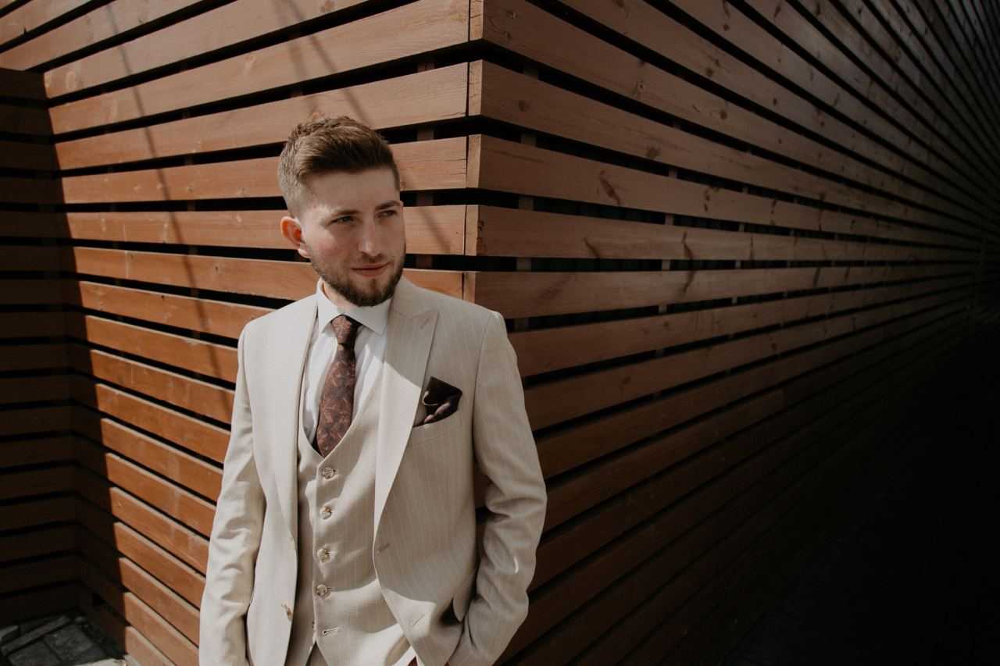

# Nick Nychyporuk
 awdw
 awadawaa
 


> ## contact

* _location_: **Rivne, Ukraine**
* _telegram_: **@Nicko10**
* _discord_: **MykolaNychyporuk(@NickNych)**

> ## info
* I am pre-junior Fronted developer
* I want to learn programming to change my life.
* I am studying on the course of RS School Frontend developer
* I already know a little bit of HTML and CSS
* I also teach JavaScript

> ## hard skills

* **HTML**
* **CSS**
* **Git**
* **Github**

> ## languages

* Ukrainian (native)
* Russian (native)
* English (A2)
> ## education
* Code basics course HTML
* Code basics course CSS
* Code basics course Js
> ## experience

```
function colourAssociation(array){
  let result = []
  for(let i = 0; i < array.length; i ++){
    let key = array[i][0];
    let value = array[i][1];
    let newObj = {
      [key]: value,}
    result.push(newObj)
  }
  return result
}
```

* HTML, CSS & Git Basics (https://nicknych.github.io/rsschool-cv/)

